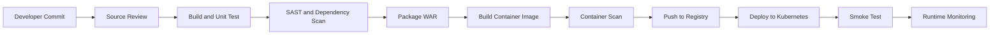

# Industry Grade Project 1 — Retail Application DevSecOps Pipeline

A portfolio-ready DevSecOps case study for a Java retail web application deployed to Kubernetes. The original Word document and application source remain preserved; this repository now adds a structured engineering narrative, security gates, architecture diagrams, and a notebook walkthrough.

## Project Theme

The application represents a retail product portal packaged as a Java web application. The delivery objective is to move source code through build, test, security validation, containerization, registry publishing, Kubernetes deployment, and runtime verification.

## Repository Navigation

```text
README.md
├── docs/
│   ├── ARCHITECTURE.md
│   └── DEVSECOPS_CONTROLS.md
├── notebooks/
│   └── industry_grade_project1_devsecops.ipynb
├── ABC Technologies/
│   └── application source and deployment artifacts
└── original Word document
```

## Delivery Flow



## Security Gate

The security stage is treated as a release gate rather than a final checklist.

- Static analysis for insecure coding patterns
- Dependency and software-composition analysis
- Secret scanning before image creation
- Container-image vulnerability scan
- Kubernetes manifest and configuration review
- Least-privilege service account and network policy review
- Runtime logging and health verification

## Applied Industry Context

For a retail platform, this pipeline supports frequent product-portal changes while controlling risks such as vulnerable dependencies, exposed secrets, unsafe container images, excessive Kubernetes permissions, and unverified production releases.

## Suggested Toolchain

| Stage | Example Tools |
|---|---|
| Source | Git and GitHub |
| Build | Maven |
| CI | Jenkins or GitHub Actions |
| SAST | Semgrep, SonarQube, CodeQL |
| SCA | OWASP Dependency-Check, Dependabot |
| Container | Docker |
| Image Scan | Trivy or Grype |
| Deploy | Kubernetes |
| Policy | Checkov, kube-score, OPA/Conftest |
| Observe | Prometheus, Grafana, centralized logs |

## How to Review This Project

1. Read `docs/ARCHITECTURE.md` for the system and pipeline diagrams.
2. Read `docs/DEVSECOPS_CONTROLS.md` for the control model.
3. Open the notebook for the complete annotated walkthrough.
4. Inspect the preserved source and original Word artifact for historical evidence.
