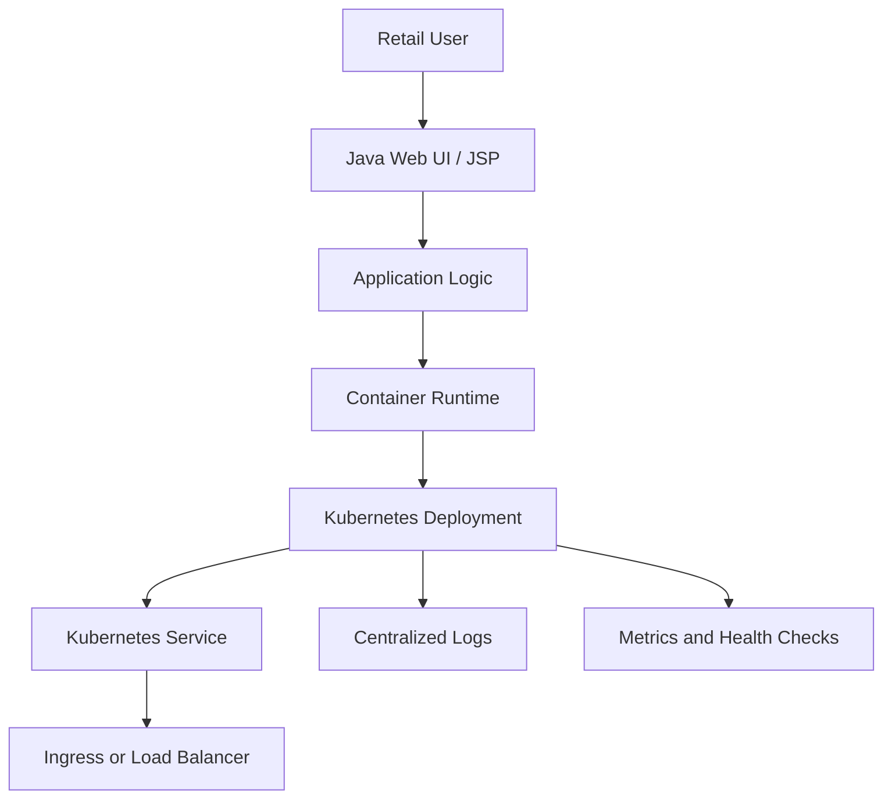
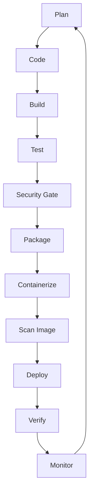
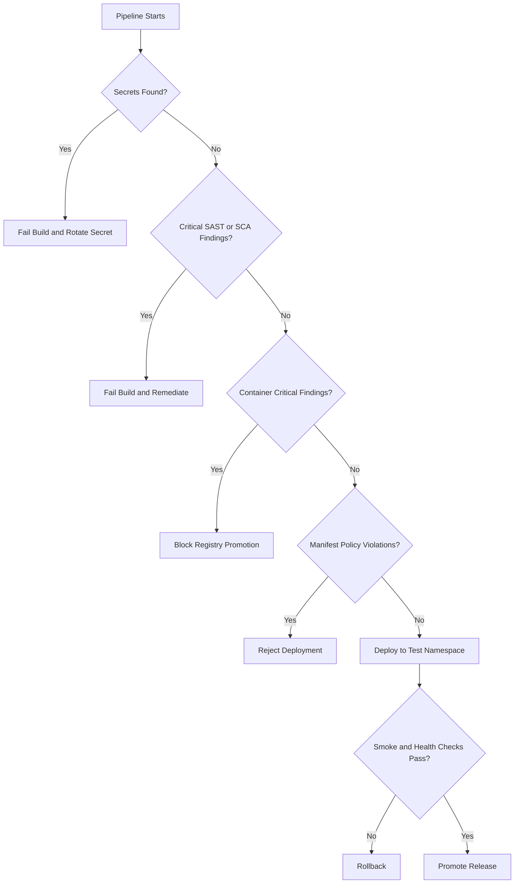
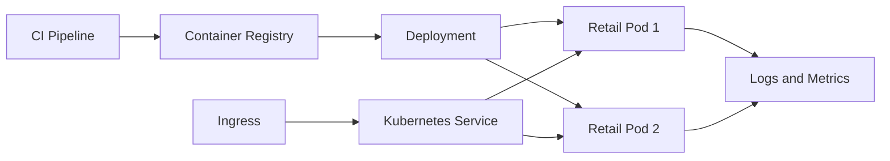

# Architecture and Delivery Model

## Application Architecture

## DevSecOps Lifecycle

## Security Decision Flow

## Kubernetes Deployment View

## Key Engineering Decisions

- Build artifacts should be reproducible and versioned.
- The container image should run as a non-root user.
- Secrets should be injected at runtime, never committed.
- Kubernetes requests, limits, liveness, and readiness probes should be defined.
- Deployments should use immutable image tags or digests.
- Rollback should be tested, not assumed.
