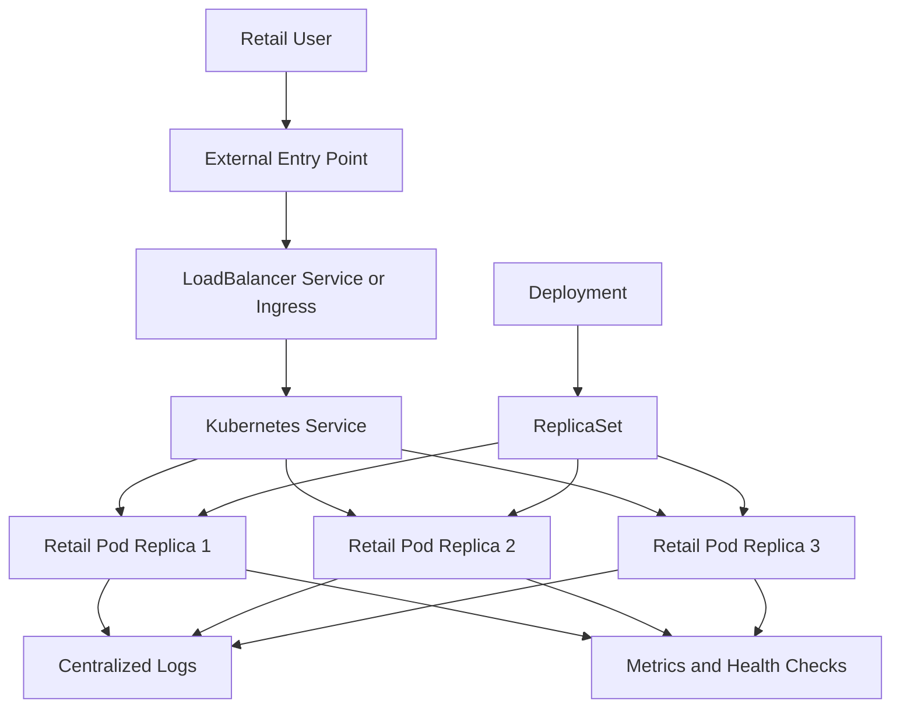
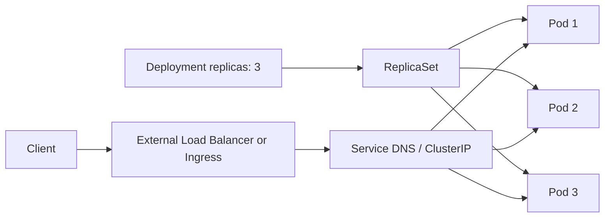
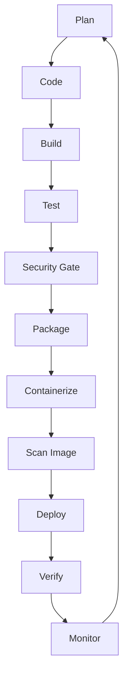
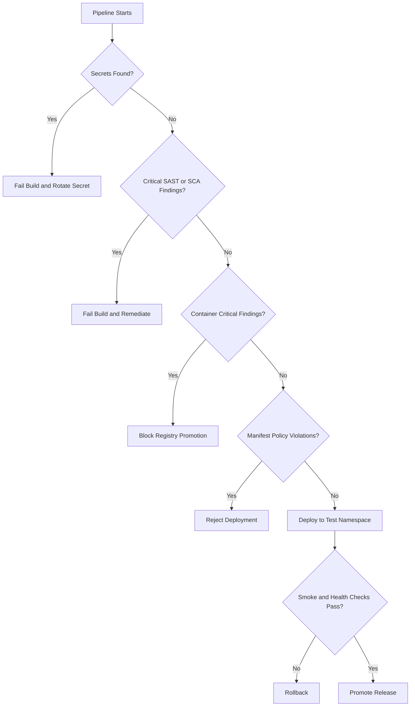
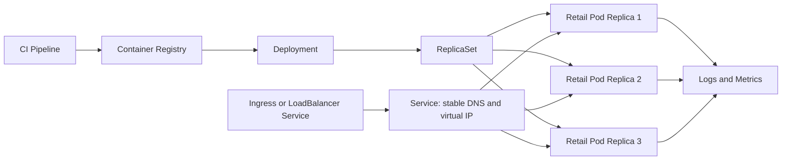

# Architecture and Delivery Model

## Application Architecture

## Kubernetes Object Relationship

A Kubernetes **Deployment** declares the desired application state and replica count. The Deployment manages a **ReplicaSet**, and the ReplicaSet maintains the requested number of **Pod replicas**. The Pods are the actual running application instances.

A **Service** selects those Pods by label and provides a stable DNS name and virtual IP. Traffic is load-balanced across healthy Pod replicas. For external access, the Service may use `type: LoadBalancer`, or an **Ingress** may route external traffic to the Service.

## DevSecOps Lifecycle

## Security Decision Flow

## Kubernetes Deployment View

## Key Engineering Decisions

- Build artifacts should be reproducible and versioned.
- The container image should run as a non-root user.
- Secrets should be injected at runtime, never committed.
- Kubernetes requests, limits, liveness, and readiness probes should be defined.
- Deployments should use immutable image tags or digests.
- Services should select Pods through stable labels.
- External traffic should enter through an Ingress or a `LoadBalancer` Service.
- Rollback should be tested, not assumed.
