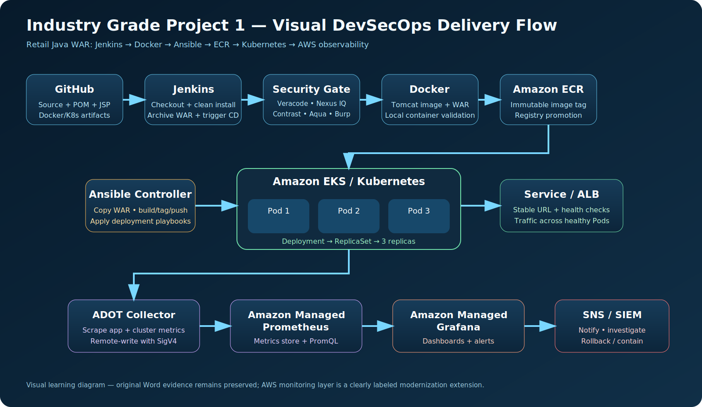
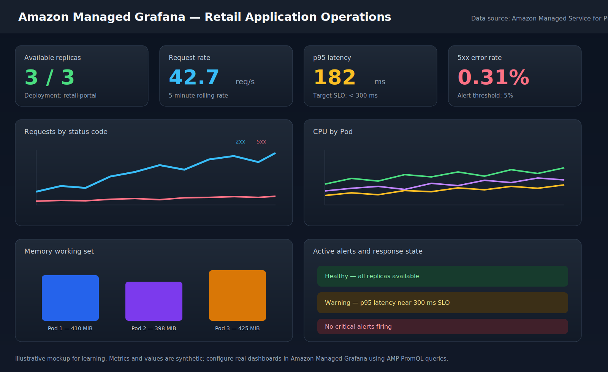

# AWS Managed Prometheus and Grafana Runbook

> **Modernization extension:** the original Word exercise remains the authoritative source for Jenkins, Maven, Tomcat, Docker, Ansible, and Kubernetes evidence. This runbook adds a reproducible AWS observability layer.

## Visual architecture





The dashboard image is a clearly labeled mockup. Its values are synthetic and should be replaced by metrics from the deployed application.

## Target architecture

- Amazon EKS runs the three application Pod replicas.
- A Kubernetes Service and AWS Load Balancer route traffic to healthy Pods.
- AWS Distro for OpenTelemetry (ADOT) or a Prometheus-compatible collector scrapes application and cluster metrics.
- Amazon Managed Service for Prometheus (AMP) stores metrics and serves PromQL.
- Amazon Managed Grafana (AMG) visualizes metrics and evaluates dashboards.
- Alertmanager-compatible rules route notifications to Amazon SNS and the approved incident-management channel.
- Fluent Bit or ADOT exports logs to CloudWatch Logs, OpenSearch, or the organization SIEM.

## 1. Prepare variables

```bash
export AWS_REGION=us-east-1
export CLUSTER_NAME=retail-platform
export AMP_ALIAS=retail-platform-metrics
export AMG_NAME=retail-platform-observability
```

Do not commit account IDs, access keys, workspace URLs, tokens, or live endpoints.

## 2. Create an AMP workspace

```bash
aws amp create-workspace \
  --alias "$AMP_ALIAS" \
  --region "$AWS_REGION"

aws amp list-workspaces --region "$AWS_REGION"
```

Record the workspace ID in the CI/CD secret store rather than hard-coding it.

```bash
export AMP_WORKSPACE_ID=<workspace-id>
export AMP_REMOTE_WRITE_URL="https://aps-workspaces.${AWS_REGION}.amazonaws.com/workspaces/${AMP_WORKSPACE_ID}/api/v1/remote_write"
export AMP_QUERY_URL="https://aps-workspaces.${AWS_REGION}.amazonaws.com/workspaces/${AMP_WORKSPACE_ID}"
```

## 3. Configure IAM for metrics ingestion

Create an IAM role that grants only the permissions needed to write metrics to AMP. Associate it with a Kubernetes service account using EKS workload identity or IRSA.

Representative permissions:

```json
{
  "Version": "2012-10-17",
  "Statement": [{
    "Effect": "Allow",
    "Action": [
      "aps:RemoteWrite",
      "aps:GetSeries",
      "aps:GetLabels",
      "aps:GetMetricMetadata"
    ],
    "Resource": "*"
  }]
}
```

Production policy should scope resources as narrowly as the service permits and separate write permissions from read/query permissions.

## 4. Install the ADOT operator or collector

Install the AWS Distro for OpenTelemetry add-on through the EKS add-on workflow or Helm, according to the organization's platform standard.

Verify the collector namespace and service account:

```bash
kubectl get pods -A | grep -i adot
kubectl get serviceaccount -A | grep -i collector
```

## 5. Configure Prometheus scraping and remote write

Example collector configuration:

```yaml
apiVersion: opentelemetry.io/v1beta1
kind: OpenTelemetryCollector
metadata:
  name: amp-collector
  namespace: monitoring
spec:
  mode: deployment
  serviceAccount: amp-collector
  config:
    receivers:
      prometheus:
        config:
          scrape_configs:
            - job_name: retail-portal
              kubernetes_sd_configs:
                - role: pod
              relabel_configs:
                - source_labels: [__meta_kubernetes_pod_label_app]
                  action: keep
                  regex: retail-portal
    processors:
      batch: {}
      memory_limiter:
        check_interval: 1s
        limit_mib: 512
    exporters:
      prometheusremotewrite:
        endpoint: ${env:AMP_REMOTE_WRITE_URL}
        auth:
          authenticator: sigv4auth
    extensions:
      sigv4auth:
        region: ${env:AWS_REGION}
        service: aps
    service:
      extensions: [sigv4auth]
      pipelines:
        metrics:
          receivers: [prometheus]
          processors: [memory_limiter, batch]
          exporters: [prometheusremotewrite]
```

Apply and verify:

```bash
kubectl apply -f monitoring/amp-collector.yaml
kubectl get pods -n monitoring
kubectl logs -n monitoring deployment/amp-collector --tail=100
```

## 6. Expose application metrics

The application should publish a Prometheus-compatible endpoint such as `/metrics` or `/actuator/prometheus`.

Recommended metrics:

- request count by method, route, and status
- request latency histogram
- active request count
- JVM heap and garbage collection
- container CPU and memory
- available replicas and restart count
- load-balancer target health
- authentication failures and access-denied events

Avoid labels containing user IDs, emails, session IDs, account numbers, request payloads, or other PII.

## 7. Create Amazon Managed Grafana

Create an AMG workspace with IAM Identity Center or the organization's approved SAML configuration. Enable the AMP data source and CloudWatch data source.

Typical workflow:

1. Create the AMG workspace.
2. Assign administrator and editor groups.
3. Grant the workspace query access to AMP.
4. Add AMP as a Prometheus data source using the workspace query endpoint.
5. Add CloudWatch for ALB, EKS, and infrastructure metrics.
6. Import or create the application dashboard.
7. restrict dashboard permissions by team and environment.

## 8. Dashboard panels and PromQL

### Available replicas

```promql
kube_deployment_status_replicas_available{deployment="retail-portal"}
```

### Unavailable replicas

```promql
kube_deployment_status_replicas_unavailable{deployment="retail-portal"}
```

### Request rate

```promql
sum(rate(http_server_requests_seconds_count[5m]))
```

### p95 latency

```promql
histogram_quantile(
  0.95,
  sum(rate(http_server_requests_seconds_bucket[5m])) by (le)
)
```

### 5xx ratio

```promql
sum(rate(http_server_requests_seconds_count{status=~"5.."}[5m]))
/
sum(rate(http_server_requests_seconds_count[5m]))
```

### CPU by Pod

```promql
sum(rate(container_cpu_usage_seconds_total{pod=~"retail-portal.*"}[5m])) by (pod)
```

### Memory by Pod

```promql
sum(container_memory_working_set_bytes{pod=~"retail-portal.*"}) by (pod)
```

## 9. Configure alerting

Example rules:

```yaml
groups:
  - name: retail-portal
    rules:
      - alert: RetailPortalReplicaUnavailable
        expr: kube_deployment_status_replicas_unavailable{deployment="retail-portal"} > 0
        for: 5m
        labels:
          severity: warning
        annotations:
          summary: Retail portal has unavailable replicas

      - alert: RetailPortalHighErrorRate
        expr: |
          sum(rate(http_server_requests_seconds_count{status=~"5.."}[5m]))
          /
          sum(rate(http_server_requests_seconds_count[5m])) > 0.05
        for: 10m
        labels:
          severity: critical
        annotations:
          summary: Retail portal 5xx rate exceeds 5 percent

      - alert: RetailPortalHighLatency
        expr: |
          histogram_quantile(0.95,
            sum(rate(http_server_requests_seconds_bucket[5m])) by (le)
          ) > 0.3
        for: 10m
        labels:
          severity: warning
```

Route alerts to SNS, then to email, chat, PagerDuty, ServiceNow, or another approved workflow. Do not place secrets in rule files.

## 10. Configure logs and SIEM feeds

Collect:

- application logs
- Tomcat access logs
- container stdout/stderr
- Kubernetes events
- EKS control-plane logs
- ALB access logs
- CloudTrail events
- GuardDuty, Security Hub, WAF, and firewall findings

Export through Fluent Bit or ADOT into CloudWatch Logs, OpenSearch, or the enterprise SIEM. Apply retention, encryption, access control, and PII filtering before centralization.

## 11. Validation checklist

```bash
kubectl get deployment,pods,svc -n <namespace>
kubectl get pods -n monitoring
kubectl logs -n monitoring deployment/amp-collector --tail=100
aws amp describe-workspace --workspace-id "$AMP_WORKSPACE_ID" --region "$AWS_REGION"
```

In AMG, confirm:

- Prometheus data source reports healthy.
- all three replicas appear.
- request and latency panels return data.
- a controlled test alert reaches the notification channel.
- logs correlate with the deployment and Pod names.

## 12. Privacy and security requirements

- Never use PII as a metric label.
- Redact private IPs, hostnames, account IDs, usernames, and tokens from screenshots.
- Encrypt metrics and logs in transit and at rest.
- Use least-privilege IAM roles and short-lived credentials.
- Separate production and non-production workspaces.
- Restrict Grafana access through identity groups.
- Define retention and deletion policies aligned with organizational requirements.
