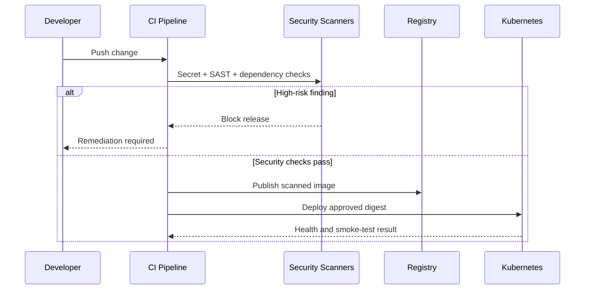

# DevSecOps Controls

## Control Objectives

| Pipeline Stage | Control Objective | Evidence |
|---|---|---|
| Commit | Prevent secrets and unsafe code from entering the repository | secret-scan and review results |
| Build | Produce a repeatable artifact from controlled dependencies | build log and artifact checksum |
| Test | Detect regressions before packaging | unit and integration test reports |
| SAST | Identify insecure coding patterns | scanner report and remediation record |
| SCA | Identify vulnerable third-party components | dependency inventory and CVE report |
| Container | Minimize image attack surface | Dockerfile review and image scan |
| Kubernetes | Enforce safe workload configuration | policy scan and manifest review |
| Release | Approve only verified artifacts | signed image or immutable digest |
| Runtime | Detect failure and suspicious behavior | health, logs, metrics, and alerts |

## Dedicated Security Stage

## Minimum Security Enhancements

- Add a `.gitignore` and prevent generated credentials or local configuration from being committed.
- Use dependency pinning and automated dependency updates.
- Run a secret scanner on every pull request.
- Fail the pipeline on critical/high findings unless a documented time-bound exception exists.
- Generate an SBOM for the release image.
- Scan the container image before registry promotion.
- Run containers as non-root with a read-only filesystem where possible.
- Define Kubernetes resource limits, probes, and restricted security context.
- Use namespaced service accounts with minimal RBAC permissions.
- Restrict ingress and east-west traffic with network policy.
- Centralize application and Kubernetes audit logs.

## Privacy and Public-Repository Review

Before publishing screenshots or documents, redact names, emails, hostnames, private IP addresses, tokens, credentials, account identifiers, organization-specific endpoints, and environment-specific architecture details. Use synthetic company and environment names for portfolio demonstrations.
